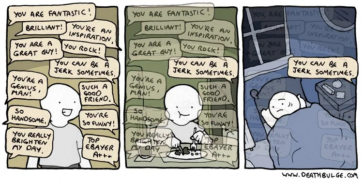

# Feedback {background-color="#880088" footer=false}

 

::: {#logo}
{width=25%}
:::

 

Kursledarprogram WCS 2025-2026

## Vad menar vi med feedback?

 

- Feedback från kursledare till deltagare
- Feedback från deltagare till kursledare
- Feedback från kursledare till kursledare

#

Tänk på en feedback du själv fick som deltagare, positiv eller negativ, som verkligen fastnade. Varför gjorde den det?

## Feedback kursledare till deltagare

 

### Varför ger vi feedback till våra deltagare? 

- Rätta till ett beteende
- Ge uppmuntran
- Visa effekten av bra versus dålig teknik

## Hur ger du feedback i dina kurser?

Korrigerar du främst:

- Individer?
- Hela gruppen?

Använder du mest:

- Verbal feedback?
- Visuell (visa själv)?
- Fysisk guidning?

Vad upplever du som svårast med att ge feedback?
Finns det något du undviker att ge feedback på? Varför?

## Vad kännetecknar bra feedback?

 

::: {.incremental}
- Nära inpå det som ges feedback på
- Konstruktiv
- Tillfälle ges att korrigera baserad på feedback
- Blandning av positiv och konstruktiv feedback
- Ge feedback på utförandet, inte personen
:::

## Feedback tas emot olika

 

- Vissa personer mer känsliga för feedback, känn av deltagarna
- Tänk på hur du formulerar dig
- Feedback med en positiv attityd tas emot bättre

## Feedback deltagare till kursledare

 

### Kursutvärderingar

- Ger möjlighet för deltagarna att framföra sina tankar om kursen
- Upptäcka mönster och vad som kan förbättras
- Undvik att fastna i enskilda personers feedback

# 

## Att hantera feedback

 

- Människor fokuserar mer på negativ feedback än positiv (du är inte ensam)
- Försök se poängen bakom feedbacken och lär från den
- Försök att inte ta det personligt

## Att hantera dålig feedback

 

- Se vad deltagarna faktiskt har lärt sig
- Diskutera med andra kursledare
- Titta på motexemplen
- Undersök mönstren, inte enskilda svar

## Feedback kursledare till kursledare

 

Hur kan vi hjälpa varandra att utvecklas som kursledare?

- Observera varandras lektioner och ge feedback
- Var tydlig med vad ni vill ha feedback på
- Träna på att ge konstruktiv feedback

## Övning: ge feedback

 

- Ett par lär ut en kort tur eller koncept
- De berättar vad de vill ha feedback på innan de börjar
- Efter utlärningen får paret reflektera över hur det gick
- De andra studerar utlärningen och ger feedback efteråt:
  - Vad var bra med sättet de lärde ut på?
  - Vad tror ni skulle kunna förbättra utlärningen?
- Paret som lär ut får sedan en chans till att lära ut samma sak och inkorporera feedbacken
- De som gav feedback berättar vad de tog med sig som de kan använda i sin egen undervisning