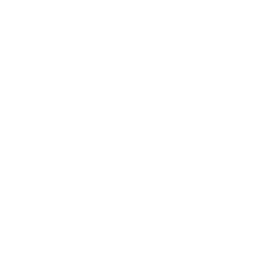

# Introduktion {background-color="#880088" footer=false}

 

::: {#logo}
{width=25%}
:::

 

Kursledarprogram WCS 2025-2026

## Målet med en Steg 2-kurs

 

Målet med fortsättningskurs Steg 2 är att deltagarna ska få solida grunder och korrekt teknik.

## Turer för en Steg 2 kurs

 

Förslag på turer som passar att lära ut på en veckokurs Steg 2-kurs, 1h x 8 tillfällen. Detta är ett förslag, och kan adapteras efter kurslängd och deltagare.

 

| Left side variations  |  Whip variations  | Right side variations  |
|-----------------------|-------------------|------------------------|
| Roll-in-roll-out      | Whip med inside/outside turn | Double outside turn |
| Slingshot             | Reversed whip     | Cut off/Hip catch |

## Tekniska koncept

 

Följande tekniska koncept är lämpliga att ta upp på en Steg 2-kurs.

 

|             |                 | 
|-------------|-----------------|
| Keep momentum  | Få följarna att fortsätta rörelsen bakåt/framåt utan att stanna sig själva |
| Snurrteknik    | Spotting, prep, korta steg |
| Body lead | Få till frame så pass att förarna inte använder biceps |

: {tbl-colwidths="[25,75]"}